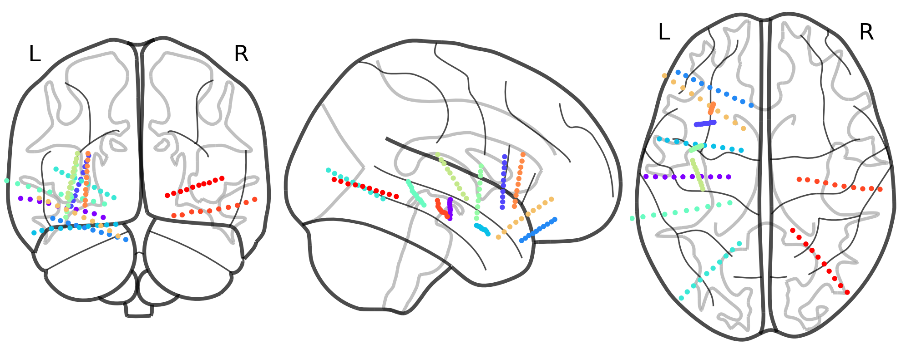

## Sample QA figures

### Coregistration of T1w without contrast to T1w+gadolinum

  

### Coregistration of post-op CT to T1w+gadolinum

  

### Electrode contact positions in 2D and 3D

<embed type="text/html" src="imgs/sub-P078_space-MNI152NLin2009cSym_desc-affine_electrodes.html" width="900" height="700"/>

