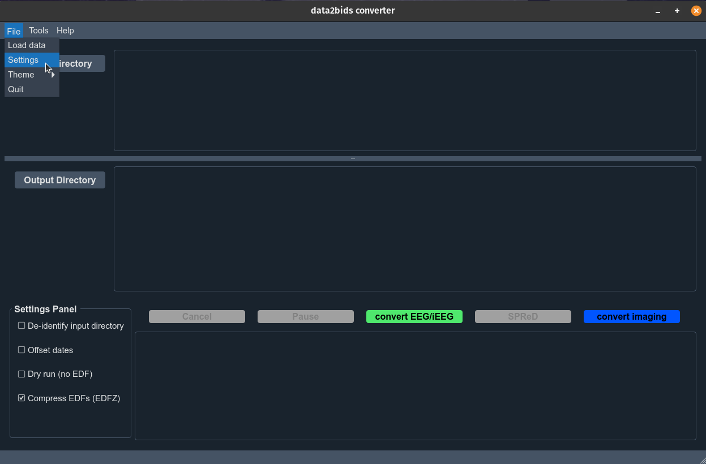
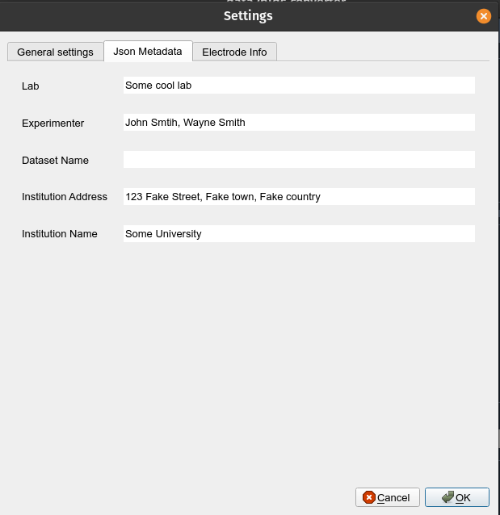
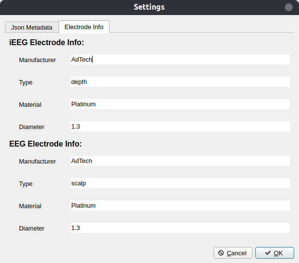
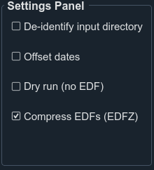

## Adjusting metadata settings

!!! note
    You will only need to modify these settings once upon initial installation of the **data2bids** software

1. In the **data2bids** software, select **File** then **Settings**.

	

     

2. A settings panel will appear with two tabs: Json Metadata and Electrode Info.

    * **Json metadata** contains general information about the dataset.
        - **Lab:** what is the name of the lab collecting this data
        - **Experimenter:** list all individuals involved in this dataset
        - **Dataset Name:** overall name for the dataset.
        - **Institution Name/Address:** name and address of the institution at which  this dataset was collected

	

     

	* **Electrode info** contains information about the specific electrodes used at the center:
  	    - **Manufacturer:** who produces the electrodes.
        - **Type:** what type of electrode is it (i.e. depth, scalp etc.)
        - **Material:** what material are the electrodes made from (i.e. platinum)
        - **Diameter:** what is the diameter of the electrode (in mm)

	

     
    
3. Once you have modified the information click **Save** and the information will be stored and used for every subsequent dataset processed by **data2bids**. You will not need to re-define these values, unless they change at your site.

## Main window settings panel

1. The settings panel is located at the bottom left of the main window.

	

     

	* **De-identify input directory**: if this is selected the input EDF/EDF+ files will be de-identified first prior to being copied. If left unchecked, then only the output directory EDF/EDF+ files will be de-identified. Default is unchecked.
	* **Offset dates**: if selected all dates in the EDF/EDF+ files will be offset by a random number of days (~1000 days). The offset value can be determined but is securely stored.
	* **Dry run**: this should be selected when running a new conversion. This option will not copy the EDF/EDF+ files to the output directory but will check to ensure the input directory is set-up correctly. Since copying the EDF/EDF+ files is a time-intensive process, this dry-run will be much faster then a full conversion and will notify you if any files are formated incorrectly within the input directory.
    * **Compress EDFs (EDFZ)**: if selected the EDF+ output files will be further compressed using GZIP (with final extension `.edfz`). For more information, see the documentation from <a href="https://zzz.bwh.harvard.edu/luna/vignettes/edfz/" target="_blank">Dr. Shaun Purcell's lab</a>  at Harvard.

 
 
  
