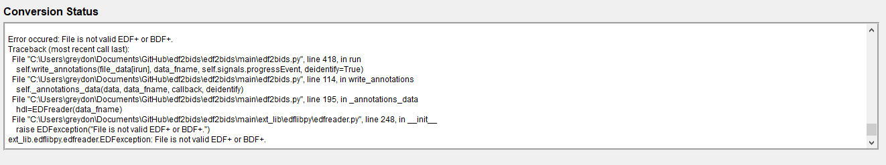
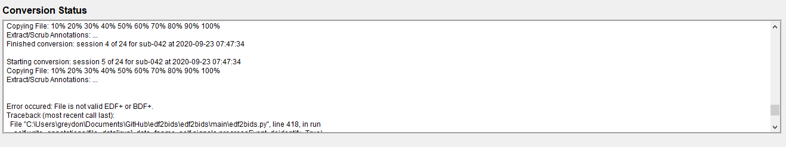
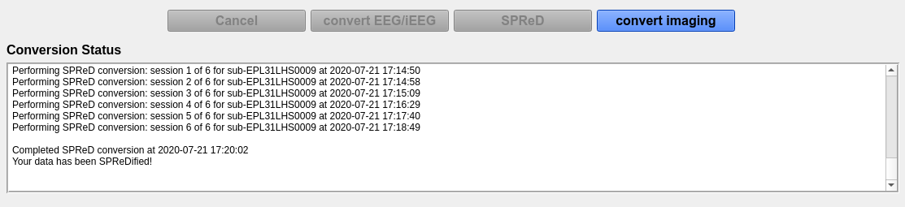
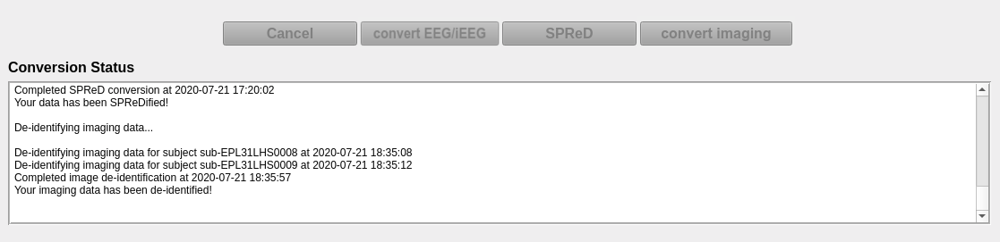

## Input directory selection

The input directory selected here should be organized according to the first section in this documentation. Prior to loading the data, make sure all the settings in the settings panel have been configured to your specification (found at the bottom left of the main window).

1. In the software, select **Input Directory** and choose the directory that contains the data to be converted (select the main/root directory that contains all subject directories). Click **Select Folder** in the window and the data will load into the **Input Directory** window.

    

 

2. You will now be able to review the information that was detected about the input files. Each subject is expandable by clicking the box beside the subject name. The columns displayed are:

!!! note "Definition of columns"
    for a complete list of column explanations see the [definitions page](02_definitions.html#data2bids-terms)

## Output directory selection

1. Once you have confirmed the input data is correct, click **Output Directory** and select the directory you want the BIDS dataset to appear. The **Output Directory** window will now present the final output file information (prior to conversion). This is the final check to ensure that any changes have been updated.

    

 

    !!! note 
        EDF/EDF+ files in the Input Directory will be **COPIED** to the new location and will be renamed to be BIDS compliant. Thus, you will have two copies of the EDF/EDF+ files. This is a safety measure in case an error occurs in the conversion, the source data will remain intact.

2. If you are converting data for a participant that already has recordings in the output folder, the check boxes for those recordings will appear checked in the **Output Directory** window.

## Dry-run prior to conversion

It is recommended that you dry-run the conversion. This ensures the input directory is set-up correctly and that the EDF files are properly formatted. During annotation extract, the EDF file format is checked using EDFBrowser libraries. Since copying the EDF file to the output directory is the most time intensive aspect, you are able to run annotation extraction (with file checking) as a separate dry-run.

If an error is found within an EDF file, you will see a message similar to this:

 

You should scroll upwards to find the last session that was being converted, prior to the error, and remove it from the input directory:

 

## Convert to BIDs

1. Once you have confirmed the Output Directory file information is correct press the green **Convert** button.

2. During the conversion process you can cancel the conversion at any time by pressing the **Cancel** button. However, if you cancel the conversion you will need to delete the contents of the output directory and start over.

3. You will receive updates in the **Conversion Status** window. The final notice, once the conversion is complete, will show **Your data has been BIDsified!**. 

    

 

## Convert to SPReD (EpLink)

!!! note
    files will be moved from the BIDS structure to SPReD structure (the BIDs format will be destroyed)

The format required to upload the Brain-CODE is different from BIDS. This conversion step will provide a SPReD compliant format output.

1. Following successful conversion to BIDS, a new button in the main window will become active named **SPReD**.

2. Press the **SPReD** button and wait for the conversion to complete.
    
    

 

## Imaging Anonymization

If an `imaging` directory was supplied in the input directory then the blue **imaging** button will be active. 

1. Following conversion to BIDS/SPReD, press the blue button named **Imaging**.

2. Wait for the conversion to complete.
    
    

 
 
 