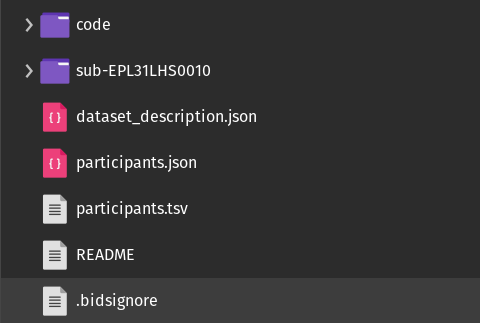
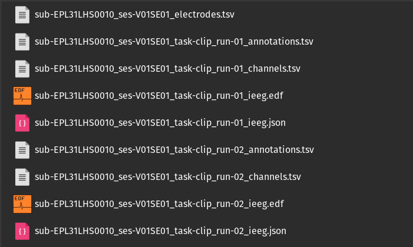
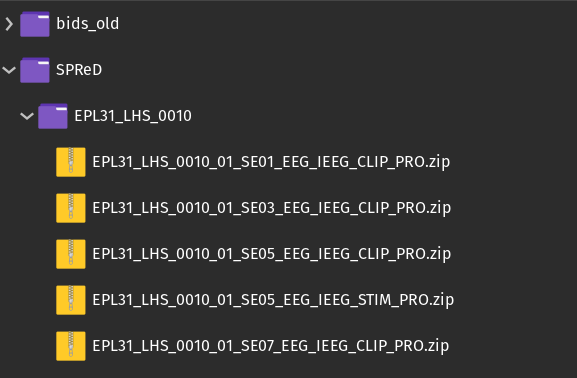

## BIDS directory structure

The output directory will look like the following (each subject having their own directory):

* **code:** this directory will contain the code used to convert the EDF/EDF+ data for each EDF/EDF+ file for the subjects.
* **dataset_description.json:** this file will contain the Json Metadata previously defined in the **Settings** menu. This is overall information about the dataset
* **participants.tsv:** this file contains a list of all the subjects in the dataset and their general demographics (i.e. age, sex etc.). This file can also be used to store additional subject information that is not variable over the different visits and sessions. 

### Electrodes vs. channels

It is important to understand the difference between the terms `electrode` and `channel`. An iEEG electrode is placed on or in the brain, whereas a channel is the combination of the analog differential amplifier and analog-to-digital converter that result in a potential (voltage) difference that is stored in the EEG/iEEG dataset.

* **Electrode:** a single point of contact between the acquisition system and the recording site. Multiple electrodes can be organized as arrays, grids, leads, strips, probes, shafts, caps (for EEG) etc.
* **Channel:** a single analog-to-digital converter in the recording system that regularly samples the value of a transducer, which results in the signal being represented as a time series in the digitized data. This can be connected to two electrodes (to measure the potential difference between them), a magnetic field or magnetic gradient sensor, temperature sensor, accelerometer etc.

### Subject directory

Within each subject directory there will be a different session sub-directory for each day of recording.
  

#### *_scans.tsv

The `*_scans.tsv` file contains general information about each EDF file for the subject (i.e. filename, recording duration, EDF+ type etc.).

<figure>
  
  <figcaption>Example content of the <b>*_scans.tsv</b> file.</figcaption>
</figure>

* **filename:** relative filename for each EDF/EDF+ file.
* **acq_time:** the date and time the recording was started in the format YYYY-MM-DDTHH:MM:SS (note: the `T` is used to separate the date from time)
* **duration:** the total duration of the EDF/EDF+ file in decimal hours
* **edf_type:** indicates the EDF type for the file, either continuous (EDF+C) or discontinuous (EDF+D) 

### Session directory

Within each session sub-directory there will be a modality sub-directory (either eeg/ieeg). Within the modality sub-directory there will be five files, containing different information associated with the specific EDF/EDF+ file.

#### *_electrodes.tsv

The `*_electrodes.tsv` file contains information associated with the electrodes used to collect the data.

<figure>
  
  <figcaption>Example content of the <b>*_electrodes.tsv</b> file.</figcaption>
</figure>

* **name:** label given to the specific channel during the recording.
* **x,y,z:** the coordinates in MRI space for the specific electrode contact.
* **size:** the diameter of the recording electrode in millimeters
* **type:** the electrode type (i.e. depth, scalp etc.)
* **material:** the electrode material.
* **manufacturer:** the manufacturer of the electrode.

#### *_channels.tsv

The `*_channels.tsv` file contains information about each channel that was used in the recording.

<figure>
  
  <figcaption>Example content of the <b>*_channels.tsv</b> file.</figcaption>
</figure>

* **name:** label of the specific channel.
* **type:** type of channel (i.e. SEEG,EEG, DBS, EOG, ECG etc.)
* **units:** physical unit of the value represented in this channel (i.e. `V` for Volt)
* **low_cutoff:** frequency used for the low pass filter applied to the channel in Hz (note: if no low pass filter was applied, `n/a` is used).
* **high_cutoff:** frequency used for the high pass filter applied to the channel in Hz (note: if no high pass filter was applied, `n/a` is used).
* **sampling_frequency:** sampling rate of the channel in Hz.
* **notch:** frequency used for the notch filter applied to the channel in Hz (note: if no notch filter was applied, `n/a` is used).
* **reference:** label for the reference (i.e. 'mastoid', 'ElectrodeName01', 'intracranial' etc.). If the channel is not known then `n/a` is used.
* **group:** which group of channels (grid/strip/seeg/depth) this channel belongs to. This is relevant because one group has one cable-bundle and noise can be shared.

#### *_annotations.tsv

The `*_annotations.tsv` file contains all annotations present in the EDF+ file, identifiers have been scrubbed.

<figure>
  
  <figcaption>Example content of the <b>*_annotations.tsv</b> file.</figcaption>
</figure>

* **onset:** the time the event occurred, relative to the time the recording began.
* **duration:** the duration of the marked event (-1 indicates no duration, which is default for all events).
* **time_abs:** the absolute time for the event (real world time).
* **time_rel:** the relative time for the event (time elapsed since the beginning of the recording).
* **event:** the event marker text.

#### \*_eeg.json or \*_ieeg.json

The `*_eeg.json/*_ieeg.json` file contains metadata information about the EDF/EDF+ file.

<figure>
  
  <figcaption>Example content of the <b>*_eeg.json</b> or <b>*_ieeg.json</b> file.</figcaption>
</figure>

* **TaskName:** name of the task, no two tasks should have the same name (i.e. `full` for a full 24hr recording, `clip` if the data has been clipped by the neurologist etc.)
* **InstitutionName:** name of the institution in charge of the equipment that produced the composite instances.
* **InstitutionAddress:** address of the institution in charge of the equipment that produced the composite instances.
* **Manufacturer:** manufacturer of the amplifier system.
* **ManufacturersModelName:** manufacturer's designation of the EEG/iEEG amplifier model.
* **SamplingFrequency:** sampling frequency (in Hz) of all the EEG/iEEG channels in the recording
* **HardwareFilters:** the frequencies of the temporal hardware filters applied, if none exist then `n/a` is used.
* **SoftwareFilters:** the frequencies of the temporal software filters applied, if none exist then `n/a` is used.
* ***ChannelCount:** number of the respective channels included in the recording (i.e. EEG, EOG, ECG, SEEG etc.)
* **PowerLineFrequency:** frequency (in Hz) of the power grid where the EEG/iEEG recording was done (for example, 50 or 60).
* **RecordingDuration:** length of the recording in decimal hours.
* **RecordingType:** defines whether the recording is `continuous`, `discontinuous` or `epoched`, where `epoched` is limited to time windows about events of interest.
* **SubjectArtefactDescription:** freeform description of the observed subject artifact and its possible cause (i.e. "door open", "nurse walked into room at 2 min", "seizure at 10 min").
* **iEEGPlacementScheme:** freeform description of the placement of the EEG/iEEG electrodes.
* **iEEGElectrodeGroups:** field to describe the way electrodes are grouped into strips, grids or depth probes.
* **iEEGReference:** general description of the reference scheme used and (when applicable) of location of the reference electrode in the raw recordings (i.e. "left mastoid", "bipolar").
* **ElectrodeManufacturer:** manufacturer for the electrodes used during the recording (i.e. AD-TECH, DIXI)
* **ElectricalStimulationParameters:** free form description of stimulation parameters, such as frequency or shape.

#### \*_eeg.edf or \*_ieeg.edf

The `*_eeg.edf/*_ieeg.edf` contains the raw electrophysiology data.

### Example Structure

#### Interactive

## SPReD directory structure

1. When the SPReD conversion is completed a new sub-directory will be created in the output directory. All unused BIDS files will be transferred to the **bids_old** sub-directory, while all the SPReD files will be moved to the **SPReD** sub-directory.

    

2. Within each sub-directory of the **.zip** folders the same files from the BIDS output will be found:

    

3. You will be uploading the **.zip** directories to Brain-CODE.

 
 
 
