## Upload data to SPReD

1. Login to <a href="https://spred.braincode.ca/spred/" target="_blank">SPReD</a> and navigate to the EPL31 project for your site.

	
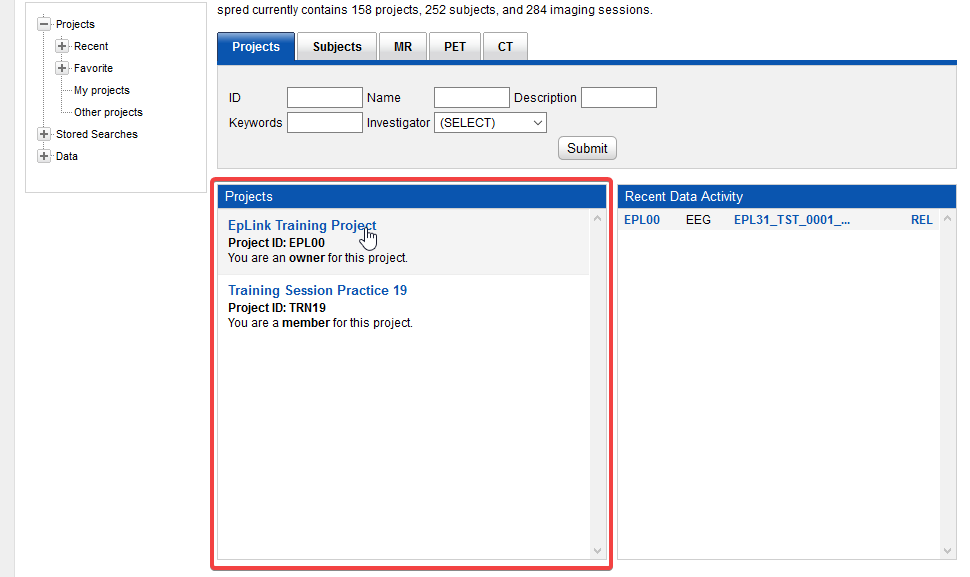
 

2. Create a new subject by pulling down the **New** menu near the top of the screen and selecting **Subject**.

	
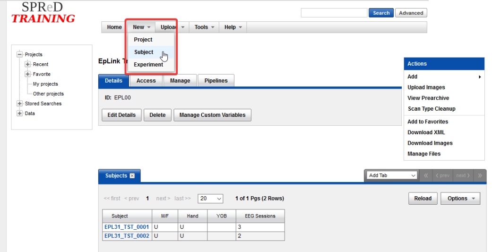
 

3. This will take you to the new subject page. It is recommended that you enter the participant’s age and gender however these are optional. The only required field is the Subject’s ID.

	
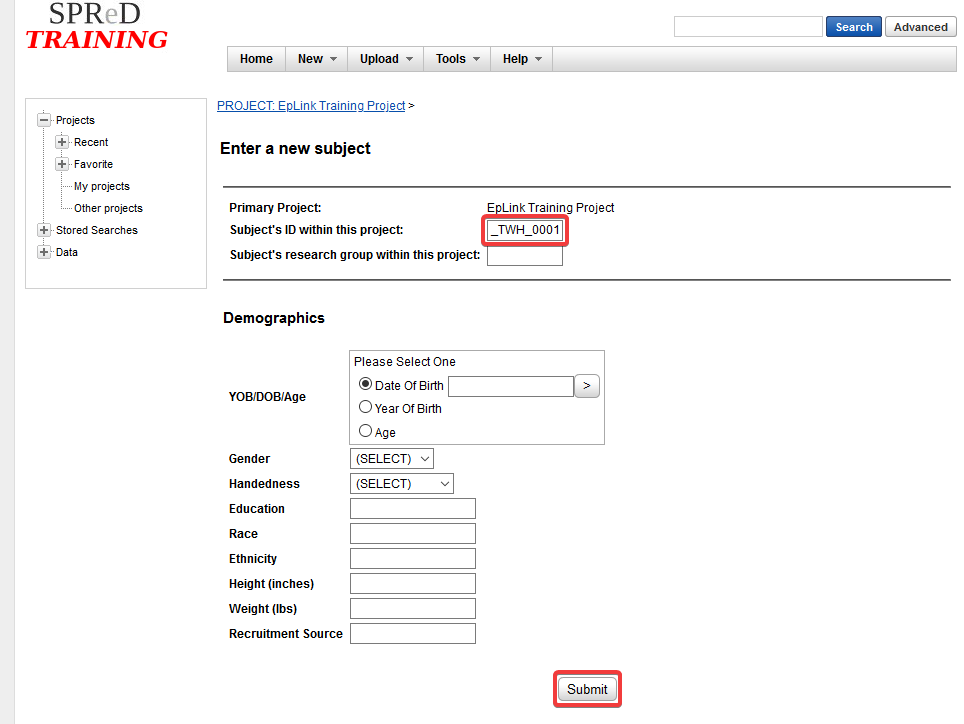
 

4. Press **Submit** at the bottom of the page when done.

5. You are now on the main subject page. From here click **Add Experiment** on the right.

	
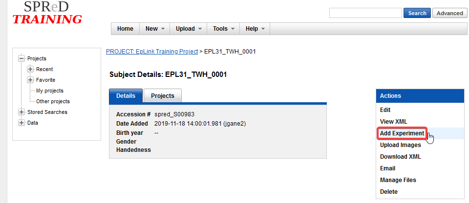
 

6. On this page, select **EEG Session**.

	
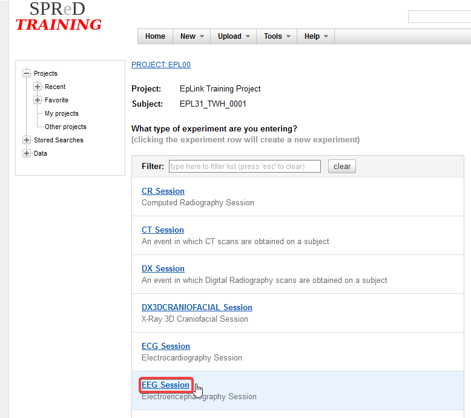
 

7. Enter the participant’s session name and visit ID, these should be the same as the zip file name. It is also recommended that you enter the date of the recording, but it is not required. In the list of scans, click the scissors icon to delete all but the first row. In the remaining row enter **1** for Scan number and **EEG** for type. You may also optionally add a note about the scan.

	

		

			
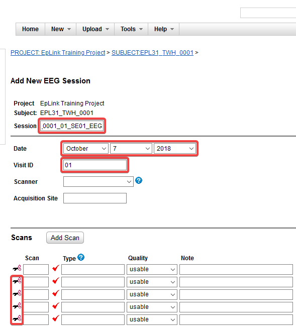

			
<a style="font-size: 48px;">&#11015;</a>

			
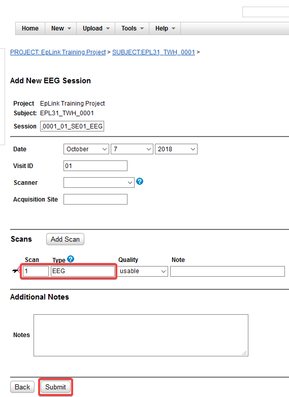

		

	

	 

8. Press **Submit** at the bottom of the page when done.

9. You are now on the main session page. From here click on **Manage Files** on the right.

	
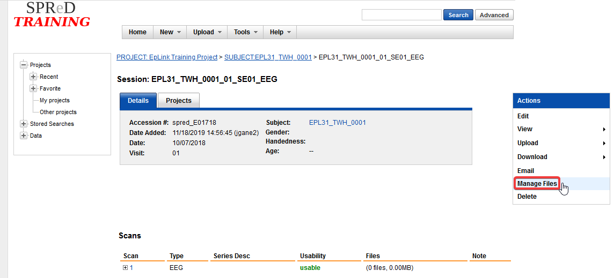
 

10. In the window that pops up, click on **Add Folder**. In the other window that pops up, for Level select **scans**, for Item select **1** and for Folder enter **EEG**. Once done click **Create**.

	
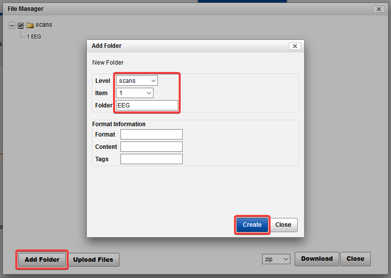
 

11. Now click on **Upload Files**. In the window that pops up select the folder we just created, for Level select **scans**, for Item select **1** and for Folder select **EEG**. Now click on **Browse…** and navigate to the zip file corresponding with the session you wish to upload.

	
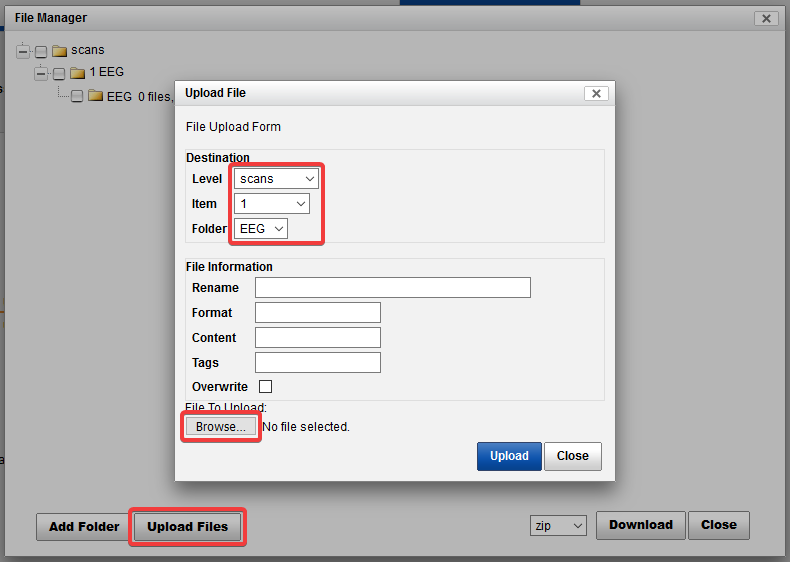
 

12. Once the file has been selected, click on **Upload**.

	
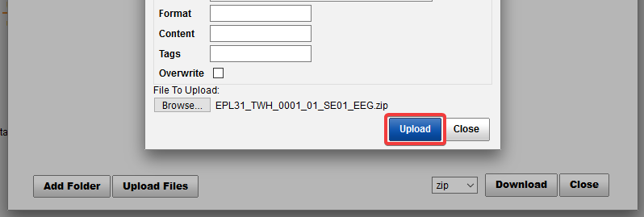
 

13. There will be another box that pops up asking you would like to extract the contents of the archive, click **Cancel**.

	
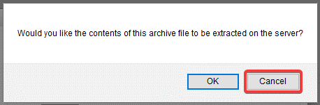
 

14. You are done! If you have more EEG sessions to upload for this participant, you can go back to the main subject page by clicking on the navigation links at the top. You can then repeat from step 5 and on.

	
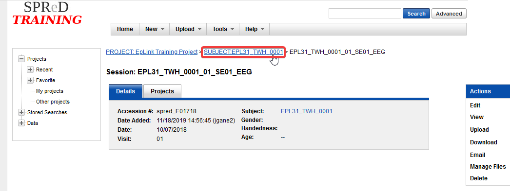
 

 
 
 