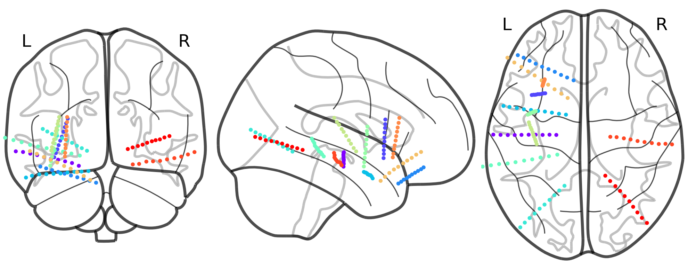

#
## seeg2bids output

The output files from _seeg2bids_ conform to the <a href="https://bids-specification.readthedocs.io/en/stable/05-derivatives/01-introduction.html" target="_blank">BIDS Derivatives specification</a>. In general, there are two classes of data outputs from _seeg2bids_:

1. **Visual QA (quality assessment):** summary figures are generated throughout the pipeline so the user can confirm accuracy.

2. **Derivative (preprocessed):** processed data that is ready for analysis after various preparation procedures have been applied (i.e. INU-corrected versions of the T1-weighted image, the brain mask, electrode contact coordinate files etc). All data is aligned into the same-subject’s T1w space.


The _seeg2bids_ output directory will be have the following structure:

```
derivatives/
	├── atlasreg/
	│		├── dataset_description.json
	│		└── sub-<subject_label>/
	│				├── qc/...
	│				└── <processed_files>...
	│
	└── seeg_coordinates/
			├── dataset_description.json
			└── sub-P001/
					└── <processed_files>...
```

For each participant in the dataset, a subject specific directory (`sub-<subject_label>`) will be generated in two locations:

1. `atlasreg`: this directory contains processed data files from the imaging analysis pipelines.
2. `seeg_coordinates`: this directory will store the electrode contact coordinates from the post-CT. 

The `dataset_description.json` is a metadata file in which seeg2bids records metadata required by the BIDS standard.


## Visual QA

*seeg2bids* generates summary figures which are stored in a directory labelled `qc` within each patient directory under `atlasreg`. The figures provide a snapshot of the results from various parts of the pipeline.

```java
derivatives/
	└── atlasreg/
		└── sub-<subject_label>/
				└── qc/...
```

## Derivative data

*seeg2bids* generates many derived data files which are stored within the respectove subject directory in two locations: `atlasreg` and `seeg_coordinates`.

### atlasreg derivatives

The anatomical data files within the `atlasreg` derivatives directory are:

```java
derivatives/
	└── atlasreg/
		└── sub-<subject_label>/
				├── qc/...
				├── sub-<subject_label>_acq-contrast_T1w.nii.gz
				├── sub-<subject_label>_acq-noncontrast_T1w.nii.gz
				├── sub-<subject_label>_ct.nii.gz
				├── sub-<subject_label>_acq-noncontrast_space-T1w_desc-affine_T1w.nii.gz
				├── sub-<subject_label>_T1w.nii.gz
				├── sub-<subject_label>_space-MNI152NLin2009cSym_desc-affine_T1w.nii.gz
				├── sub-<subject_label>_desc-brain_from-MNI152NLin2009cSym_reg-affine_mask.nii.gz
				├── sub-<subject_label>_label-CSF_from-MNI152NLin2009cSym_reg-affine_probseg.nii.gz
				├── sub-<subject_label>_label-GM_from-MNI152NLin2009cSym_reg-affine_probseg.nii.gz
				├── sub-<subject_label>_label-WM_from-MNI152NLin2009cSym_reg-affine_probseg.nii.gz
				├── sub-<subject_label>_space-T1w_desc-affine_ct.nii.gz
				├── sub-<subject_label>_space-ct_desc-mask_contacts.nii.gz
				├── sub-<subject_label>_desc-n4_T1w.nii.gz
				├── sub-<subject_label>_desc-atroposKseg_dseg.nii.gz
				├── sub-<subject_label>_desc-atroposKseg_probseg.nii.gz
				├── sub-<subject_label>_label-CSF_desc-atropos3seg_probseg.nii.gz
				├── sub-<subject_label>_label-GM_desc-atropos3seg_probseg.nii.gz
				├── sub-<subject_label>_label-WM_desc-atropos3seg_probseg.nii.gz
				├── sub-<subject_label>_desc-atropos3seg_probseg.nii.gz
				├── sub-<subject_label>_desc-brain_from-atropos3seg_mask.nii.gz
				├── sub-<subject_label>_desc-masked_from-atropos3seg_T1w.nii.gz
				├── sub-<subject_label>_space-MNI152NLin2009cSym_desc-SyN_T1w.nii.gz
				├── sub-<subject_label>_atlas-CerebrA_from-MNI152NLin2009cSym_reg-SyN_dseg.nii.gz
				└── sub-<subject_label>_desc-dilated_atlas-CerebrA_from-MNI152NLin2009cSym_reg-SyN_dseg.nii.gz
```

Spatially-standardized derivatives are denoted with a `space-` label. Within patient volumes are registered to the volumetric T1w so the space is denoated `space-T1w` for these volumes. Other derivatives will have been coregistered to a template space, such as `MNI152NLin2009cSym`.

The registration transform matricies are stored in `.txt` and `.tfm` files to allow for easy loading into 3D Slicer.

```java
derivatives/
	└── atlasreg/
		└── sub-<subject_label>/
				├── qc/...
				├── sub-<subject_label>_acq-noncontrast_desc-affine_from-T1w_to-T1w_type-ras_xfm.txt
				├── sub-<subject_label>_desc-affine_from-subject_to-MNI152NLin2009cSym_type-itk_xfm.txt
				├── sub-<subject_label>_desc-affine_from-subject_to-MNI152NLin2009cSym_type-ras_xfm.txt
				├── sub-<subject_label>_desc-affine_from-ct_to-T1w_type-ras_xfm.txt
				├── sub-<subject_label>_from-subject_to-MNI152NLin2009cSym_Composite.h5
				└── sub-<subject_label>_from-subject_to-MNI152NLin2009cSym_InverseComposite.h5
```

The remaining files provide information about the pipeline.

```java
derivatives/
	└── atlasreg/
		└── sub-<subject_label>/
				├── qc/...
				├── sub-<subject_label>_desc-atropos3seg_mapping.json
				├── sub-<subject_label>_desc-dilated_atlas-CerebrA_from-MNI152NLin2009cSym_electrodes.tsv
				└── sub-<subject_label>_desc-dilated_atlas-CerebrA_from-MNI152NLin2009cSym_electrodes.xlsx
```

The files within the `qc` derivatives directory are:

```
derivatives/
	└── atlasreg/
		└── sub-<subject_label>/
				└── qc/
					├── sub-<subject_label>_acq-contrast_from-T1w_to-T1w_regqc.png
					├── sub-<subject_label>_desc-masked_from-ct_to-T1w_regqc.png
					├── sub-<subject_label>_desc-affine_from-subject_to-MNI152NLin2009cSym_regqc.html
					├── sub-<subject_label>_desc-affine_from-subject_to-MNI152NLin2009cSym_regqc.png
					├── sub-<subject_label>_desc-atropos3seg_probseg.png
					├── sub-<subject_label>_atlas-CerebrA_from-MNI152NLin2009cSym_dseg.html
					├── sub-<subject_label>_atlas-CerebrA_from-MNI152NLin2009cSym_dseg.png
					├── sub-<subject_label>_desc-dilated_atlas-CerebrA_from-MNI152NLin2009cSym_dseg.png
					├── sub-<subject_label>_space-ct_desc-mask_contacts.html
					├── sub-<subject_label>_space-MNI152NLin2009cSym_desc-affine_electrodes.html
					└── sub-<subject_label>_space-MNI152NLin2009cSym_desc-affine_electrodevis.png
```


### seeg_coordinates derivatives

The files within the `seeg_coordinates` derivatives directory are:

```
derivatives/
	└── seeg_coordinates/
		└── sub-<subject_label>/
				├── sub-<subject_label>_mapping.tsv
				├── sub-<subject_label>_space-T1w_mcp.tfm
				├── sub-<subject_label>_space-acpc_actual.fcsv
				├── sub-<subject_label>_space-acpc_actual.tsv
				├── sub-<subject_label>_space-acpc_planned.fcsv
				├── sub-<subject_label>_space-acpc_planned.tsv
				├── sub-<subject_label>_space-acpc_SEEGA.fcsv
				├── sub-<subject_label>_space-acpc_SEEGA.tsv
				├── sub-<subject_label>_space-native_actual.fcsv
				├── sub-<subject_label>_space-native_actual.tsv
				├── sub-<subject_label>_space-native_planned.fcsv
				├── sub-<subject_label>_space-native_planned.tsv
				├── sub-<subject_label>_space-native_SEEGA.fcsv
				└── sub-<subject_label>_space-native_SEEGA.tsv
```

## Sample QA figures

### Coregistration of T1w without contrast to T1w+gadolinum

<center></center>
<br><br>

### Coregistration of post-op CT to T1w+gadolinum

<center></center>
<br><br>

### Electrode contact positions in 2D and 3D

<center></center>


<center><embed type="text/html" src="imgs/sub-P078_space-MNI152NLin2009cSym_desc-affine_electrodes.html" width="900" height="700"/></center>
