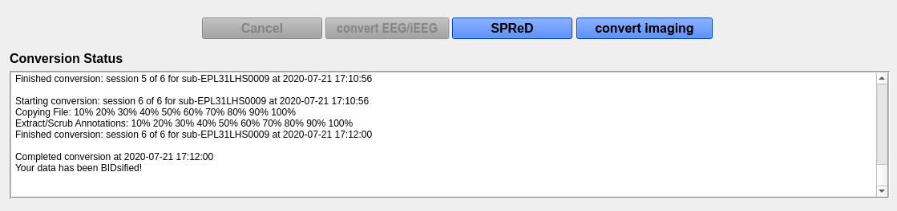

# Input/Output Directories

## Input directory selection

The input directory selected here should be organized according to the first section in this documentation. Prior to loading the data, make sure all the settings in the settings panel have been configured to your specification (found at the bottom left of the main window).

1. In the software, select **Input Directory** and choose the directory that contains the data to be converted (select the main/root directory that contains all subject directories). Click **Select Folder** in the window and the data will load into the **Input Directory** window.

    

2. You will now be able to review the information that was detected about the input files. Each subject is expandable by clicking the box beside the subject name. The columns displayed are:

    * **Name:** this is the name of the subdirectory within the patient folder that contains the EDF/EDF+ file. If the EDF/EDF+ files are all in the same directory, then the name will be the name of the EDF/EDF+ files.
    * **Date:** the date the data was recorded.
    * **Time:** the time the data was recorded.
    * **Size:** the size of the EDF/EDF+ file in gigabytes.
    * **Frequency (adjustable):** the frequency the data was recorded at. This is automatically calculated based on information extracted from the EDF/EDF+ file. However, if there is an error then the user can double click on the frequency box and manually change it.
    * **Duration:** the total duration of the EDF/EDF+ file recording, which is automatically calculated. 
    * **EDF Type:** type of EDF+ file (EDF+D/EDF+C). This field should always show EDF+C, if EDF+D then the file should be [converted first](check_edf_type.html#convert-edf-type).
    * **Type (selectable):** the type of EEG data collected (Intracranial or Scalp). This value is automatically detected by the flags `_EEG/_IEEG` used in the directory name. This value can be changed by the user if there is an error.
    * **Task (selectable):** the condition of the recorded file: Full, clip or cortical stimulation (CS). This value is automatically detected by the flags `_CLIP/_FULL/_CS` used in the directory name. This can be changed by the user if there is an error.
    * **Ret/Pro (selectable):** whether the data file is retrospective or prospective. This value is automatically detected based on the RET flag used in the directory name. This value can be changed by the user if there is an error.
    * **Channel File:** this indicates if a channel_labels.txt file was found. If you notice the labels changed in a specific session you can include a channel_label.txt file within each session folder. Yes indicates a channel label file was found, No otherwise.

## Output directory selection

1. Once you have confirmed the input data is correct, click **Output Directory** and select the directory you want the BIDS dataset to appear. The **Output Directory** window will now present the final output file information (prior to conversion). This is the final check to ensure that any changes have been updated.

    

    !!! note 
        EDF/EDF+ files in the Input Directory will be **COPIED** to the new location and will be renamed to be BIDS compliant. Thus, you will have two copies of the EDF/EDF+ files. This is a safety measure in case an error occurs in the conversion, the source data will remain intact.

2. If you are converting data for a participant that already has recordings in the output folder, the checkboxes for those recordings will appear checked in the **Output Directory** window.

3. Once you have confirmed the Output Directory file information is correct press **Convert**.

4. During the conversion process you can cancel the conversion at any time by pressing the **Cancel** button. However, if you cancel the conversion you will need to delete the contents of the output directory and start over.

5. You will receive updates in the **Conversion Status** window. The final notice, once the conversion is complete, will show **Your data has been BIDsified!**. 

  

  